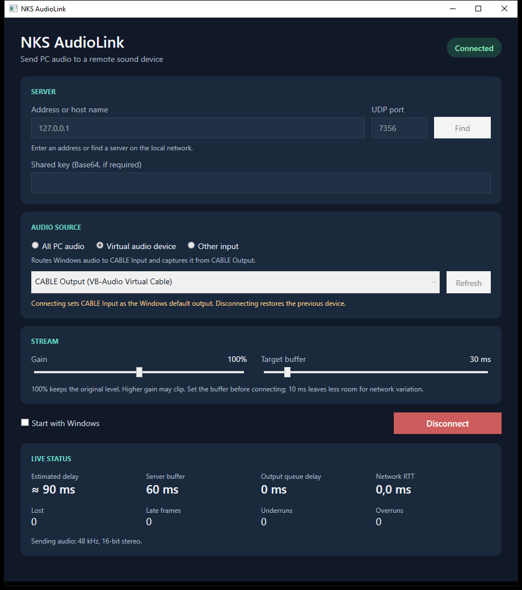

# NKS AudioLink

NKS AudioLink přenáší zvuk z Windows PC po LAN na fyzickou zvukovou kartu jiného počítače. Klient je napsaný v C#/.NET 9 a zachytává zvuk přes WASAPI. Server běží v C#/.NET 9 na Linuxu a zapisuje přímo do ALSA; nevyžaduje PulseAudio ani PipeWire.

```text
Windows aplikace → WASAPI → UDP PCM → jitter buffer a korekce driftu → ALSA → zvuková karta
```

Přenos používá stereo PCM S16_LE, 48 kHz, pětimilisekundové rámce. Cílem je latence pod 100 ms pro video. Zatím chybí ověřené měření celkové latence, proto ji projekt negarantuje.

## Aktuální stav

Implementované jsou protokol s volitelným HMAC, UDP server, ALSA/WAV/null výstup, Windows WASAPI klient, CLI, grafické rozhraní se statistikami a nastavením, automatické vyhledání serveru a jednotkové testy. Služba serveru běží přímo na linuxovém hostiteli přes systemd. VB-CABLE je na testovacím PC nainstalován; skutečný přenos virtuálním zařízením a obnova výchozího výstupu po odpojení i pádu aplikace byly ověřeny. Ověřená dokončení a zbývající kroky jsou v [TODO.md](TODO.md).

Na skutečné LAN byl ověřen pětisekundový přenos testovacího tónu do WAV: délka 5,095 s, RMS 8 484, dominantní energie na 440 Hz, bez přetečení a pozdních rámců. Nejnovější desetiminutový test instalované služby systemd měl nulová podtečení, přetečení, ztráty i pozdní rámce v klientských statistikách i závěrečném záznamu serveru. CLI po tónu posílá krátké tiché zakončení pro vyprázdnění bufferu. Windows WASAPI loopback zachytil skutečný zvuk do WAV a grafická aplikace přenáší výstup PC na fyzický ALSA výstup vzdáleného serveru. Virtuální režim byl ověřen 440Hz signálem přes CABLE Input a CABLE Output do WAV. Poslech na vzdálené zvukové kartě a fyzická celková latence dosud nejsou potvrzeny.



### Latence a zátěž

Při živém přenosu z grafické aplikace ukazují statistiky síťový buffer 25 ms, zpoždění ALSA 19 ms a RTT 0,5 ms. Se skutečnou periodou WASAPI 10 ms, vyrovnávací frontou klienta přibližně 15 ms a rámcováním 5 ms vychází odhad **74 ms** od zachycení po ALSA výstup. Hodnota se mění s aktuálním stavem bufferů; tento výpočet není fyzické měření celého řetězce. Zátěž aktuálního serveru při přenosu je asi 3 % jednoho jádra; plánovaný limit pod 2 % zatím nebyl splněn.

| Úsek při živém přenosu (2026-10-02) | Hodnota | Zjištění |
|---|---:|---|
| WASAPI capture | 10 ms | Skutečná délka bufferu po spuštění |
| Fronta klienta | ≈15 ms | Cílová hodnota, nikoli měření |
| Rámcování | 5 ms | Formát protokolu |
| Síť | ≈0,25 ms | Polovina naměřeného RTT 0,5 ms |
| Jitter buffer | 25 ms | STATS serveru |
| ALSA výstup | 19 ms | `snd_pcm_delay` |
| **Celkem** | **≈74 ms** | **Součet; fyzická latence dosud nezměřena** |

Podrobnosti ověření a jeho hranice jsou v [docs/VALIDATION.md](docs/VALIDATION.md).

Samostatná zkouška na cílovém Linuxu změřila část od odeslání UDP paketu do zápisu kliknutí do WAV: **27,36–28,69 ms**, medián **28,22 ms** pro devět kliknutí při cílovém bufferu 30 ms. Odesílač i server používaly stejné monotónní hodiny a loopback síť. Toto měření nezahrnuje Windows capture, fyzickou LAN, ALSA ani receiver.

## Použití

Pro sestavení vyžaduje .NET SDK **9.0.318** nebo novější opravu téže řady; verzi určuje `global.json`. Na Windows sestavíte celé řešení příkazem `dotnet build NksAudioLink.sln` a spustíte testy pomocí `dotnet test NksAudioLink.sln`. Publikované aplikace obsahují potřebný runtime. Windows klient a přípravu virtuální zvukovky popisuje [docs/WINDOWS.md](docs/WINDOWS.md); Linux server a jeho službu nainstalujete podle [docs/INSTALL.md](docs/INSTALL.md).

Server ve výchozím nastavení naslouchá na UDP portu 7355. Bez konfiguračního souboru přijímá pouze spojení z loopbacku a používá nulový výstup. Pro provoz v LAN vycházejte z [deploy/linux/server.json.example](deploy/linux/server.json.example), nastavte `allowCidrs` na vlastní důvěryhodnou síť a zvolte ALSA zařízení. Místní `server.json` a klíče neukládejte do repozitáře.

```sh
./NksAudioLink.Server run --config /etc/nks-audiolink/server.json
./NksAudioLink.Server devices
```

Na Windows lze bez dalšího ovladače zachytávat celý výstup vybraného zařízení přes WASAPI loopback. CLI nabízí seznam zařízení a odeslání:

```powershell
dotnet run --project src/NksAudioLink.Cli -- devices
dotnet run --project src/NksAudioLink.Cli -- discover
dotnet run --project src/NksAudioLink.Cli -- send --server SERVER_IP --mode loopback
dotnet run --project src/NksAudioLink.Cli -- test-tone --server SERVER_IP --seconds 5
```

CLI podporuje `--port`, `--latency` (u `send`), `--device`, `--mode capture` a `--config`. Režim `capture` použijte pro záznamový endpoint virtuální zvukovky. Grafickou aplikaci spustíte z projektu `src/NksAudioLink.App`. Nabízí režim celého zvuku PC, virtuální zvukovky a jiného vstupu, nastavení serveru, portu, sdíleného klíče, hlasitosti a latence, tray a živé statistiky. Klíč se neukládá do souboru nastavení. VB-CABLE je samostatný podepsaný ovladač jiného výrobce; projekt jej nedistribuuje ani bez rozhodnutí uživatele neinstaluje.

Konfigurace podporuje `port`, `name`, `sink`, `allowCidrs`, `pskBase64`, `idleReleaseSec` a `targetLatencyMs` na serveru a `server`, `port`, `targetLatencyMs`, `gain`, `pskBase64` na klientovi. PSK musí obsahovat nejméně 16 náhodných bajtů zakódovaných Base64. HMAC ověřuje původ paketů; zvuk není šifrovaný. Protokol popisuje [docs/PROTOCOL.md](docs/PROTOCOL.md).

## Vývoj a licence

Repozitář je zatím soukromý. Žádná veřejná licence nebyla zvolena; všechna práva vyhrazena. Při případném zveřejnění nesmí být v historii soukromé adresy, přístupové údaje, lokální konfigurace ani binární soubory cizích ovladačů.
