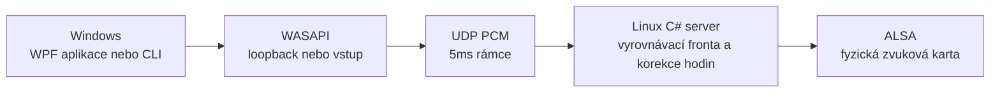

[](https://github.com/nks-hub/nks-audiolink/actions/workflows/ci.yml)
[](https://github.com/nks-hub/nks-audiolink/actions/workflows/release.yml)
[](https://dotnet.microsoft.com/)
[](#jak-to-funguje)
[](#licence)

# NKS AudioLink

**NKS AudioLink přenáší zvuk z Windows PC na zvukovou kartu linuxového počítače po místní síti.** Windows klient zachytává zvuk přes WASAPI a posílá nekomprimované stereo PCM po UDP. Server v C#/.NET 9 jej přehrává přímo přes ALSA. Na Linuxu nepotřebuje PulseAudio, PipeWire ani grafické prostředí.

Projekt nabízí grafickou aplikaci pro Windows, příkazového klienta a službu systemd. Zvuk se přenáší ve formátu stereo PCM S16_LE při 48 kHz v rámcích po 5 ms. Přenos je určený pro důvěryhodnou LAN nebo VPN. Celková fyzická latence zatím není změřená.


## Co umí

- **Tři režimy zachytávání:** celý výstup vybraného zařízení přes WASAPI loopback, samostatně nainstalovaný VB-CABLE nebo jiné záznamové zařízení. Režim VB-CABLE během spojení přepne výchozí výstup Windows na virtuální zařízení.
- **Přímý výstup na Linuxu:** server zapisuje do ALSA a může běžet jako neprivilegovaná služba systemd. Pro diagnostiku nabízí také zápis do WAV a výstup bez zvukové karty.
- **Plynulý tok:** vyrovnávací fronta tlumí krátké výkyvy přenosu po síti. Korekce rozdílných hodin zvukových zařízení a tiché rámce udržují časovou osu. Klient se obnoví po výpadku serveru nebo chybě zachytávání.
- **Ovládání a přehled:** WPF aplikace nabízí vyhledání serveru, nastavení vyrovnávací fronty a zesílení, ikonu v oznamovací oblasti a živé statistiky. Příkazový klient umí vypsat zařízení, vyhledat server, posílat zvuk a přehrát testovací tón.
- **Kontrola přístupu:** server omezuje klienty pomocí `allowCidrs`. Volitelný podpis HMAC se sdíleným klíčem ověřuje původ paketů. Zvuk není šifrovaný.

VB-CABLE je ovladač [VB-Audio](https://vb-audio.com/Cable/). Není součástí AudioLinku a pro běžný WASAPI loopback není potřeba.

## Jak to funguje



Server obsluhuje jednu aktivní relaci. Výchozí UDP port je `7355`. Bez konfigurace přijímá jen spojení ze stejného počítače a zvuk nikam nepřehrává. Pro provoz v síti je nutné nastavit vlastní `allowCidrs` a ALSA zařízení. Podrobnosti formátu paketů jsou v [popisu protokolu](docs/PROTOCOL.md).

## Rychlý start

### Připravené balíčky

Po vydání označené verze stáhněte z [GitHub Releases](https://github.com/nks-hub/nks-audiolink/releases) balíčky `nks-audiolink-windows-x64.zip` a `nks-audiolink-linux-x64.tar.gz`. Obsahují .NET runtime 9.0.20; na cílových počítačích jej není třeba instalovat zvlášť. Windows archiv obsahuje `NksAudioLink.App.exe` a CLI v adresáři `cli`.

Instalaci služby popisuje [linuxový návod](docs/INSTALL.md). Z rozbaleného balíčku nejprve spusťte v root shellu instalátor:

```sh
sh deploy/linux/install.sh ./NksAudioLink.Server
```

Poté podle [server.json.example](deploy/linux/server.json.example) upravte `/etc/nks-audiolink/server.json`, zejména `sink`, `allowCidrs` a případný `pskBase64`, a spusťte `systemctl enable --now nks-audiolink`. Instalátor uloží binárku a jednotku, ale službu sám nespustí ani nerestartuje. Na Windows otevřete `NksAudioLink.App.exe`, zadejte adresu serveru nebo použijte **Najít**, zvolte zdroj a stiskněte **Připojit**. Podrobný postup včetně volitelné virtuální zvukovky je v [návodu pro Windows](docs/WINDOWS.md).

### Sestavení ze zdrojů

Je potřeba .NET SDK **9.0.318** nebo novější oprava stejné řady podle [global.json](global.json). Na Windows:

```powershell
dotnet build NksAudioLink.sln -c Release
dotnet test NksAudioLink.sln -c Release
dotnet run --project src/NksAudioLink.App
```

Server pro Linux x64 publikujte příkazem `dotnet publish src/NksAudioLink.Server/NksAudioLink.Server.csproj -c Release -r linux-x64 --self-contained true -p:PublishSingleFile=true -o publish/linux-x64`. Příkazy pro běh, konfiguraci a kontrolu ALSA jsou v [instalačním návodu](docs/INSTALL.md).

## Co je ověřené

| Ověření | Výsledek a hranice |
|---|---|
| Automatické testy | 39 testů přenositelného Core/serveru/fronty a 7 Windows integračních UDP testů prošlo. Pokrytí Core: **86,93 % řádků**, 76,01 % větví. |
| Skutečná LAN a ALSA služba | Předchozí verze běžela **600 s** při cílové frontě 30 ms bez podtečení, přetečení, ztrát a pozdních rámců. Nová verze běžela 600 s se stabilní relací; všech 120 kontrol zastihlo ALSA ve stavu RUNNING. Při ručně zvolených 10 ms však čítače ztrát, pozdních rámců a podtečení vzrostly z 3 na 59. Přetečení zůstalo na nule. |
| Tón a virtuální režim | Přenos 440 Hz tónu z Windows na Linux do WAV trval 5,095 s, RMS 8 484, bez přetečení a pozdních rámců. Přenos přes CABLE Input a CABLE Output byl potvrzen analýzou WAV. |
| Odhad latence v aplikaci | Při živém přenosu **≈74 ms**: WASAPI 10 ms, cílová fronta klienta ≈15 ms, rámec 5 ms, polovina doby obousměrné síťové odezvy (RTT) ≈0,25 ms, vyrovnávací fronta serveru 25 ms a zpoždění ALSA 19 ms. Jde o součet známých částí, ne o fyzické měření celého řetězce. |
| Změřená latence po LAN | U devíti kliknutí trval úsek od odeslání UDP paketu na Windows po zápis do WAV na Linuxu **22,96–37,88 ms**, medián **31,39 ms**. Měření nezahrnuje zachytávání přes WASAPI, ALSA ani receiver. |
| CPU | Nový server během přenosu do fyzické ALSA trvajícího 600 s spotřeboval **1,277 % jednoho jádra**; předchozí verze spotřebovala přibližně 3 %. Izolovaný test bez zvukové karty naměřil po úpravě 1,40 %. |

Majitel potvrdil čistý poslech na receiveru. Zbývá posoudit synchronizaci s videem, nezávisle změřit celkovou fyzickou latenci, vyzkoušet uspání PC a fyzické odpojení sítě a zopakovat dlouhý test nové služby s cílovou frontou 30 ms. [Úplný protokol ověření](docs/VALIDATION.md) rozlišuje měření od odhadů; [TODO.md](TODO.md) sleduje zbývající fáze.

## Dokumentace

| Téma | Odkaz |
|---|---|
| Instalace, konfigurace a provoz Linux serveru | [docs/INSTALL.md](docs/INSTALL.md) |
| Windows aplikace, CLI a volitelný VB-CABLE | [docs/WINDOWS.md](docs/WINDOWS.md) |
| UDP protokol | [docs/PROTOCOL.md](docs/PROTOCOL.md) |
| Testy, měření a jejich omezení | [docs/VALIDATION.md](docs/VALIDATION.md) |
| Stav prací a historie změn | [TODO.md](TODO.md) · [CHANGELOG.md](CHANGELOG.md) |

## Podpora

- 📧 **E-mail:** dev@nks-hub.cz
- 🐛 **Chyby a návrhy:** [GitHub Issues](https://github.com/nks-hub/nks-audiolink/issues)

## Licence

**Všechna práva vyhrazena.** Zveřejnění zdrojového kódu samo o sobě neposkytuje licenci ke kopírování, úpravám ani distribuci projektu. NAudio je samostatně licencováno pod MIT a publikované balíčky obsahují licence přibaleného .NET runtime; podrobnosti jsou v [THIRD_PARTY_NOTICES.md](THIRD_PARTY_NOTICES.md).

---

<p align="center">
  Made with ❤️ by <a href="https://github.com/nks-hub">NKS Hub</a>
</p>
