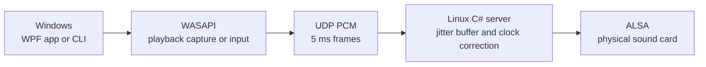

[](https://github.com/nks-hub/nks-audiolink/actions/workflows/ci.yml)
[](https://github.com/nks-hub/nks-audiolink/actions/workflows/release.yml)
[](https://dotnet.microsoft.com/)
[](#how-it-works)
[](#license)

# NKS AudioLink

**Stream audio from a Windows PC to a Linux sound card over your local network.** The Windows client captures playback or an input device through WASAPI, the Windows audio API, and sends uncompressed stereo PCM over UDP. The C#/.NET 9 server plays it through ALSA, the Linux audio interface.

AudioLink provides a Windows WPF app, a command-line client and a Linux systemd service. Audio uses 48 kHz, 16-bit stereo samples in 5 ms frames. The server runs without PulseAudio, PipeWire or a desktop session. The transport is intended for a trusted LAN or VPN; physical end-to-end latency has not been measured.


The app is connected to a localhost diagnostic server in this screenshot. Its null output does not play through a physical sound card.

## Features

- **Three capture modes:** the full output of a selected playback device, a separately installed VB-CABLE virtual device, or another recording input. Virtual mode switches the Windows default output while connected and restores it on disconnect.
- **Linux audio output:** direct ALSA playback as an unprivileged systemd service. WAV and null outputs are available for diagnostics.
- **Timing and recovery:** a jitter buffer absorbs short variations in packet arrival. Clock drift correction and silent frames keep the audio timeline running. The client reconnects after server outages and recreates capture after a device error.
- **Controls and statistics:** server discovery, target buffer, live gain adjustment, a system tray menu and statistics for buffer fill, output queue delay, network RTT, lost and late frames, underruns and overruns.
- **Access control:** `allowCidrs` restricts client addresses. An optional shared key authenticates packets with HMAC. Audio is not encrypted.

[VB-CABLE](https://vb-audio.com/Cable/) is a separate VB-Audio driver. AudioLink does not bundle it; ordinary WASAPI loopback capture does not require it.

## How it works



The server accepts one active session. The default UDP port is `7355`. With its default configuration it accepts only local connections and uses the null output. Set `allowCidrs` and an ALSA device before using it across a network. See the [protocol reference](docs/PROTOCOL.md) for packet formats.

## Quick start

### Portable packages

Tagged releases will provide `nks-audiolink-windows-x64.zip` and `nks-audiolink-linux-x64.tar.gz` on [GitHub Releases](https://github.com/nks-hub/nks-audiolink/releases). Both include .NET runtime 9.0.20, so the target machines do not need a separate runtime installation. The Windows archive contains `NksAudioLink.App.exe` and the CLI in `cli/`.

From the extracted Linux package, run the installer in a root shell:

```sh
sh deploy/linux/install.sh ./NksAudioLink.Server
```

Edit `/etc/nks-audiolink/server.json` using [server.json.example](deploy/linux/server.json.example), especially `sink`, `allowCidrs` and any `pskBase64`, then run `systemctl enable --now nks-audiolink`. The installer installs the binary and unit but does not start or restart the service. See the [Linux installation guide](docs/INSTALL.md) for configuration and updates.

On Windows, open `NksAudioLink.App.exe`, enter the server address or use **Find**, choose a source and select **Connect**. The [Windows guide](docs/WINDOWS.md) covers the app, CLI and optional virtual-device mode.

### Build from source

Use .NET SDK **9.0.318** or a later patch allowed by [global.json](global.json). On Windows:

```powershell
dotnet build NksAudioLink.sln -c Release
dotnet test NksAudioLink.sln -c Release
dotnet run --project src/NksAudioLink.App
```

To publish the Linux x64 server:

```sh
dotnet publish src/NksAudioLink.Server/NksAudioLink.Server.csproj \
  -c Release -r linux-x64 --self-contained true \
  -p:PublishSingleFile=true -o publish/linux-x64
```

## Validation

| Check | Result and scope |
|---|---|
| Automated tests | 39 portable Core/server/queue tests and 7 Windows UDP integration tests passed. Core coverage: **86.93% of lines**, 76.01% of branches. |
| LAN and physical ALSA | The .NET 9.0.20 server and Windows client ran for **600 seconds with a 30 ms target buffer**. All 60 client samples showed zero lost or late frames, underruns and overruns. ALSA was RUNNING in all 120 samples; the server process and session remained unchanged. A separate 10 ms run accumulated late frames. |
| Tone and virtual mode | A 440 Hz Windows-to-Linux WAV test lasted 5.095 seconds with RMS 8,484 and no overruns or late frames. CABLE Input to CABLE Output transport was also confirmed by WAV analysis. |
| UI latency estimate | One live observation was **about 74 ms**: 10 ms WASAPI capture, about 15 ms client queue, a 5 ms frame, about 0.25 ms half-RTT, 25 ms server buffer and 19 ms ALSA queue delay. This is a sum of known stages, not a physical end-to-end measurement. |
| Measured LAN stage | Nine clicks took **22.96–37.88 ms**, median **31.39 ms**, from the Windows UDP send call to a Linux WAV write. This excludes WASAPI capture, ALSA playback and the receiver. |
| Server CPU | The 600-second physical ALSA run at 30 ms used **1.262% of one CPU core**, compared with about 3% before tuning. An isolated null-output test used 1.40%. |

The owner confirmed clean playback on the receiver. Video synchronization, physical network disconnection and PC sleep/resume checks remain. Physical end-to-end latency has not been independently measured. [Validation details](docs/VALIDATION.md) distinguish measurements from estimates; [TODO.md](TODO.md) tracks the remaining phases.

## Documentation

| Topic | Guide |
|---|---|
| Linux installation, configuration and operation | [docs/INSTALL.md](docs/INSTALL.md) |
| Windows app, CLI and optional VB-CABLE | [docs/WINDOWS.md](docs/WINDOWS.md) |
| UDP protocol | [docs/PROTOCOL.md](docs/PROTOCOL.md) |
| Tests, measurements and their limits | [docs/VALIDATION.md](docs/VALIDATION.md) |
| Progress and changes | [TODO.md](TODO.md) · [CHANGELOG.md](CHANGELOG.md) |

## Support

- 📧 **Email:** dev@nks-hub.cz
- 🐛 **Bug reports and ideas:** [GitHub Issues](https://github.com/nks-hub/nks-audiolink/issues)

## License

**All rights reserved.** Publishing the source does not grant permission to copy, modify or distribute AudioLink. NAudio has its own MIT license; packages also include the licenses for the bundled .NET runtime. See [THIRD_PARTY_NOTICES.md](THIRD_PARTY_NOTICES.md).

---

<p align="center">
  Made with ❤️ by <a href="https://github.com/nks-hub">NKS Hub</a>
</p>
