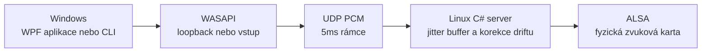

[](https://github.com/nks-hub/nks-audiolink/actions/workflows/ci.yml)
[](https://github.com/nks-hub/nks-audiolink/actions/workflows/release.yml)
[](https://dotnet.microsoft.com/)
[](#jak-to-funguje)
[](#licence)

# NKS AudioLink

**Zvuk z Windows PC na zvukovou kartu linuxového počítače po místní síti.** Windows klient zachytává audio přes WASAPI a posílá jej jako UDP PCM. Server je také napsaný v C#/.NET 9 a přehrává přímo přes ALSA. Na Linuxu nepotřebuje PulseAudio, PipeWire ani grafické prostředí.

Projekt nabízí grafickou aplikaci pro Windows, CLI a serverovou službu systemd. Přenos používá stereo PCM S16_LE při 48 kHz v 5ms rámcích. Je určený pro důvěryhodnou LAN nebo VPN; cílem je odezva vhodná pro video, ale celková fyzická latence zatím není změřená.


## Co umí

- **Dva zdroje zvuku:** WASAPI loopback přenáší celý výstup vybraného zařízení. Režim virtuální zvukovky zachytává samostatně nainstalovaný VB-CABLE a během spojení na něj přepne výchozí výstup Windows. Lze vybrat i jiné záznamové zařízení.
- **Přímý Linux výstup:** server zapisuje do ALSA a může běžet jako neprivilegovaná služba systemd. Pro diagnostiku nabízí také WAV a null výstup.
- **Plynulý tok:** jitter buffer, korekce rozdílných hodin zvukových zařízení a tiché rámce udržují časovou osu. Klient se umí obnovit po výpadku serveru nebo chybě zachytávání.
- **Ovládání a přehled:** WPF aplikace nabízí vyhledání serveru, nastavení bufferu a hlasitosti, ikonu v oznamovací oblasti a živé statistiky. CLI umí vypsat zařízení, vyhledat server, posílat zvuk a přehrát testovací tón.
- **Kontrola přístupu:** server omezuje klienty pomocí `allowCidrs`; volitelné HMAC se sdíleným klíčem ověřuje pakety. Přenášené PCM není šifrované.

VB-CABLE je ovladač [VB-Audio](https://vb-audio.com/Cable/). Není součástí AudioLinku a pro běžný WASAPI loopback není potřeba.

## Jak to funguje



Server obsluhuje jednu aktivní relaci. Výchozí UDP port je `7355`. Bez konfigurace přijímá jen klienta z loopbacku a používá null výstup; pro provoz v síti je nutné nastavit vlastní `allowCidrs` a ALSA zařízení. Podrobnosti formátu paketů jsou v [popisu protokolu](docs/PROTOCOL.md).

## Rychlý start

### Připravené balíčky

Po vydání označené verze stáhněte z [GitHub Releases](https://github.com/nks-hub/nks-audiolink/releases) balíčky `nks-audiolink-windows-x64.zip` a `nks-audiolink-linux-x64.tar.gz`. Obsahují .NET runtime 9.0.20; na cílových počítačích jej není třeba instalovat zvlášť. Windows archiv obsahuje `NksAudioLink.App.exe` a CLI v adresáři `cli`.

Instalaci služby popisuje [linuxový návod](docs/INSTALL.md). Z rozbaleného balíčku nejprve spusťte v root shellu instalátor:

```sh
sh deploy/linux/install.sh ./NksAudioLink.Server
```

Poté podle [server.json.example](deploy/linux/server.json.example) upravte `/etc/nks-audiolink/server.json`, zejména `sink`, `allowCidrs` a případný `pskBase64`, a spusťte `systemctl enable --now nks-audiolink`. Instalátor uloží binárku a jednotku, ale službu sám nespustí ani nerestartuje. Na Windows otevřete `NksAudioLink.App.exe`, zadejte adresu serveru nebo použijte **Najít**, zvolte zdroj a stiskněte **Připojit**. Podrobný postup včetně volitelné virtuální zvukovky je v [návodu pro Windows](docs/WINDOWS.md).

### Sestavení ze zdrojů

Je potřeba .NET SDK **9.0.318** nebo novější oprava stejné řady podle [global.json](global.json). Na Windows:

```powershell
dotnet build NksAudioLink.sln -c Release
dotnet test NksAudioLink.sln -c Release
dotnet run --project src/NksAudioLink.App
```

Server pro Linux x64 publikujte příkazem `dotnet publish src/NksAudioLink.Server/NksAudioLink.Server.csproj -c Release -r linux-x64 --self-contained true -p:PublishSingleFile=true -o publish/linux-x64`. Příkazy pro běh, konfiguraci a kontrolu ALSA jsou v [instalačním návodu](docs/INSTALL.md).

## Co je ověřené

| Ověření | Výsledek a hranice |
|---|---|
| Automatické testy | 39 testů přenositelného Core/serveru/fronty a 7 Windows integračních UDP testů prošlo. Pokrytí Core: **86,93 % řádků**, 76,01 % větví. |
| Skutečná LAN a ALSA služba | Souvislý **600s přenos** na dosavadní živé službě: 0 podtečení, přetečení, ztrát i pozdních rámců podle klienta a závěrečných statistik serveru. Fyzický ALSA výstup byl ve stavu RUNNING. |
| Tón a virtuální režim | Přenos 440Hz tónu z Windows na Linux do WAV trval 5,095 s, RMS 8 484, bez přetečení a pozdních rámců. Přenos přes CABLE Input a CABLE Output byl potvrzen analýzou WAV. |
| Odhad latence UI | Při živém přenosu **≈74 ms**: WASAPI 10 ms, cílová fronta klienta ≈15 ms, rámec 5 ms, polovina RTT ≈0,25 ms, jitter buffer 25 ms a ALSA delay 19 ms. Jde o součet známých částí, nikoli o fyzické měření celého řetězce. |
| Změřená softwarová latence | Na cílovém Linuxu vyšlo pro devět kliknutí UDP loopback → WAV **27,36–28,69 ms**, medián **28,22 ms**, při cílovém bufferu 30 ms. Test nezahrnuje Windows capture, fyzickou LAN, ALSA ani receiver. |
| CPU | Předchozí živý přenos s fyzickou ALSA spotřeboval přibližně **3 % jednoho jádra**. Nový .NET 9.0.20 server a systemd nastavení v izolovaném null testu snížily CPU z **3,87 % na 1,40 %** bez podtečení a pozdních rámců. Nová verze je aktivní; výsledek s ALSA se právě ověřuje zvlášť. |

Stále zbývá potvrdit čistý poslech na receiveru a synchronizaci s videem, nezávisle změřit celkovou fyzickou latenci, vyzkoušet uspání PC a fyzické odpojení sítě a zopakovat dlouhý ALSA test s optimalizovanou službou. [Úplný protokol ověření](docs/VALIDATION.md) rozlišuje měření od odhadů; [TODO.md](TODO.md) sleduje zbývající fáze.

## Dokumentace

| Téma | Odkaz |
|---|---|
| Instalace, konfigurace a provoz Linux serveru | [docs/INSTALL.md](docs/INSTALL.md) |
| Windows aplikace, CLI a volitelný VB-CABLE | [docs/WINDOWS.md](docs/WINDOWS.md) |
| UDP protokol | [docs/PROTOCOL.md](docs/PROTOCOL.md) |
| Testy, měření a jejich omezení | [docs/VALIDATION.md](docs/VALIDATION.md) |
| Stav prací a historie změn | [TODO.md](TODO.md) · [CHANGELOG.md](CHANGELOG.md) |

## Podpora

- 📧 **E-mail:** dev@nks-hub.cz
- 🐛 **Chyby a návrhy:** [GitHub Issues](https://github.com/nks-hub/nks-audiolink/issues)

## Licence

**Všechna práva vyhrazena.** Zveřejnění zdrojového kódu samo o sobě neposkytuje licenci ke kopírování, úpravám ani distribuci projektu. NAudio je samostatně licencováno pod MIT a publikované balíčky obsahují licence přibaleného .NET runtime; podrobnosti jsou v [THIRD_PARTY_NOTICES.md](THIRD_PARTY_NOTICES.md).

---

<p align="center">
  Made with ❤️ by <a href="https://github.com/nks-hub">NKS Hub</a>
</p>
